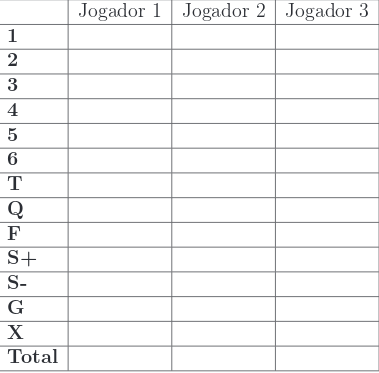

# TRABALHO DE PROGRAMAÇÃO ORIENTADA A OBJETOS - **JOGO GENERAL**

- Primeiro Trabalho da disciplina de Programação Orientada a Objetos
- **Data de início 16/09/2019**
-  **Data de término 04/10/2019**
- Professora: Luciene  De Oliveira Marin   
- Curso: Engenharia de Computação
- Acadêmicos:  
**Gabriel Prando**  
**Vitor Oliveira dos Santos**
*** 

## **Regras Básicas**

1. Sendo 13 o número de jogadas possíveis e 13 o número de l
inhas de cada coluna na cartela de marcação, um jogo consiste de 13 rodadas, ou 13 jogadas para cada jogador.

2. Cada jogador, em sua vez, tem apenas uma chance de arremes sar os dados.

3. O resultado obtido ao final do arremesso deve ser classificado, pelo próprio jogador, comouma das seguintes 13 possibilidades:

* **Jogada de 1**:  
Um certo número de dados (de 0 a 5) marcando o número 1;  
sendo que a jogada vale mais pontos conforme a quantidade de dados que marcarem o número 1. Por exemplo: 1-1-1-4-5 vale 3 pontos.

* **Jogadas de 2, 3, 4, 5 e 6**:  
Correspondentes à jogada de 1 para os demais números. Por exemplo: 3-3-4-4-5 vale 6 pontos se for considerada uma joga da de 3; ou 8 pontos se for considerada uma jogada de 4; ou ainda 5 pontos se for uma jogada de 5.

* **Trinca (T)**:  
Três dados marcando o mesmo número. Vale a soma dos 5 dados.
Exemplo:4-4-4-5-6 vale 23 pontos.

* **Quadra (Q)**:  
Quatro dados marcando o mesmo número. Vale a soma dos 5 dados. Exemplo:1-5-5-5-5 vale 21 pontos.

* **Full-hand (F) ou Full-house**:  
Uma trinca e um par (exemplo: 2-2-2-6-6). Vale 25 pontos
para qualquer combinação.

* **Sequência alta (S+)**:  
2-3-4-5-6. Vale 30 pontos.

* **Sequência baixa (S-)**:  
1-2-3-4-5. Vale 40 pontos.

* **General (G)**:  
Cinco dados marcando o mesmo número (por exemplo: 4-4-4-4-
4). Vale 50 pontos.

* **Jogada aleatória (X)**:  
Qualquer combinação. Vale a soma dos 5 dados. Por exemplo: 1-4-4-5-6 vale 20 pontos.

4. O resultado  é mostrado na forma de cartela (Fig.1), na coluna do jogador e na linha correspondente à jogada. Aquela linha (e portanto aquela jogada) não poderá mais ser utilizada pelo jogador na mesma partida.

5. Se um determinado resultado não cumprir os requisitos para a jogada escolhida, o jogador zera a respectiva jogada. E ainda, se um determinado resultado não puder ser classificado como nenhuma das jogadas ainda restantes para aquele jogador, ele deverá escolher qual das jogadas restantes será descartada, marcando 0 (zero) para
a jogada correspondente.

6. Ao final de 13 rodadas, com a cartela toda preenchida, somam-se os valores de cada coluna, e o jogador que obtiver mais pontos será considerado o vencedor.

## **Tabela do Jogo**

