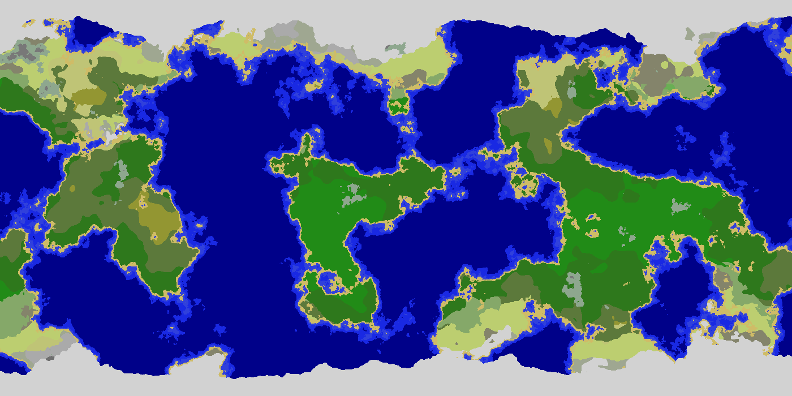
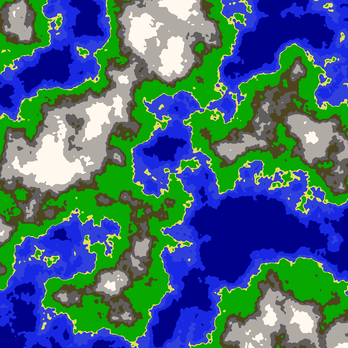
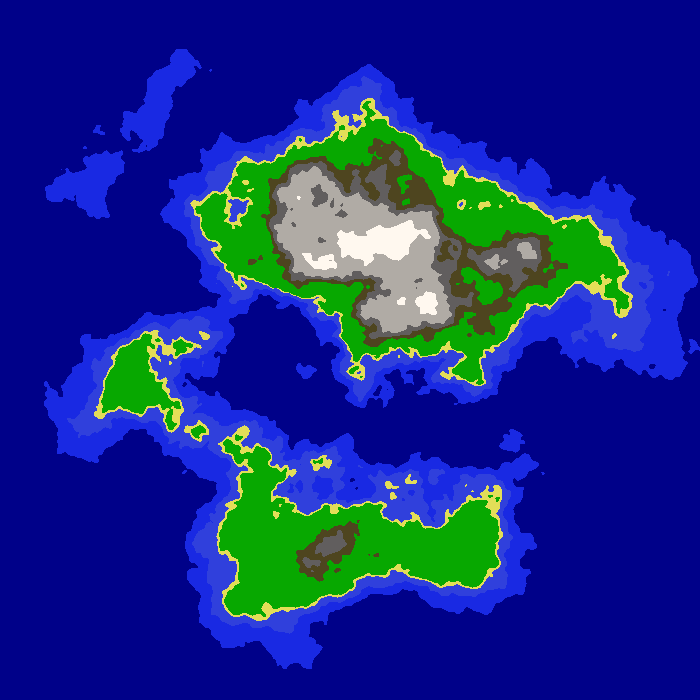

## About the Project
An application using noise functions to procedurally generate two-dimensional maps, built with Java.

All Credits to:
 - [MapMaker by Zaccheuss](https://github.com/Zaccheuss/MapMaker)
## Screen Shots

## Installation and Setup Instructions
Open project in Intellij IDEA or a similar IDE and run the `Application` class.

Sample maps have already been generated. Change the parameters of the examples to generate different maps.
