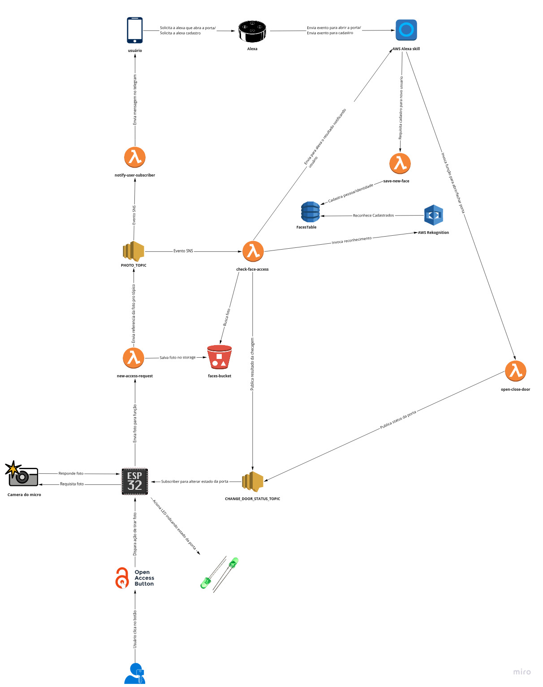

# Projeto de Oficina

## Proposta

* Objetivos: Construir um sistema de fechadura de portas baseado em reconhecimento facial com integração com a Alexa.

* Motivação: A automação residencial tem se tornado cada vez mais presente nos nossos dias, podemos acionar o sistema de ar condicionado de uma casa remotamente, fechar cortinas e janelas, regar plantas e alimentar animais a distância. Visto isso, é necessário que existam maiores cuidados com a segurança da casa. Atualmente existem diversos sistemas de fechadura para porta podendo variar desde a tradicional chave, tags, reconhecimento de digitais e mais recentemente, o reconhecimento facial. Por meio do reconhecimento facial, podemos eliminar a necessidade de uma chave física e também ter uma segurança maior ao registrar possíveis tentativas de entradas a um ambiente. Um fator importante para essa solução é a integração com serviços em nuvem, estes disponibilizam servidores, serviços de inteligência artificial e diversos outros serviços que fazem com que a solução se torne mais simples de ser implementada.

* Projeto Original: [Intelligent Door Lock Alexa Face Recognition](https://hackaday.io/project/181086-intelligent-door-lock-alexa-face-recognition).

## Arquitetura

## Cronograma

| Tarefa | Data de entrega | Status
|:---:|:---:|:---:
| Criar Recursos na AWS | 25/03 | OK
| Captura do evento no ESP32 | 08/04 | OK
| Coleta de imagem no ESP32 | 22/04 | OK
| Envio de imagem via ESP32 | 13/05 | EM ANDAMENTO
| População inicial do Dynamo e Teste de Reconhecimento | 27/05
| Acionamento LED de indicação via ESP32| 27/05
| Teste e coleta de Resultados | 10/06

## Get Started
